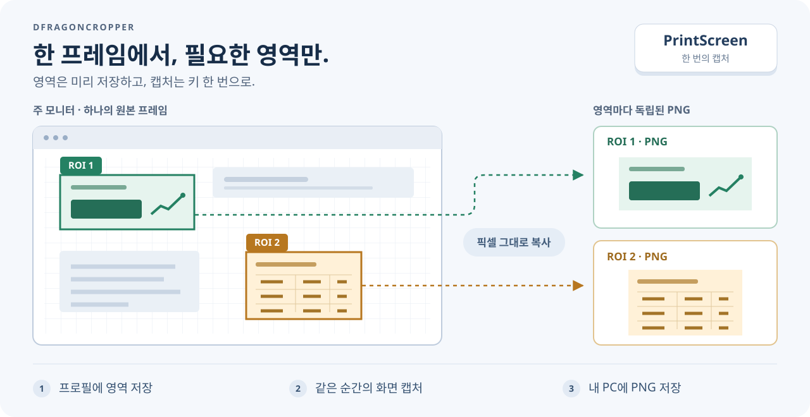
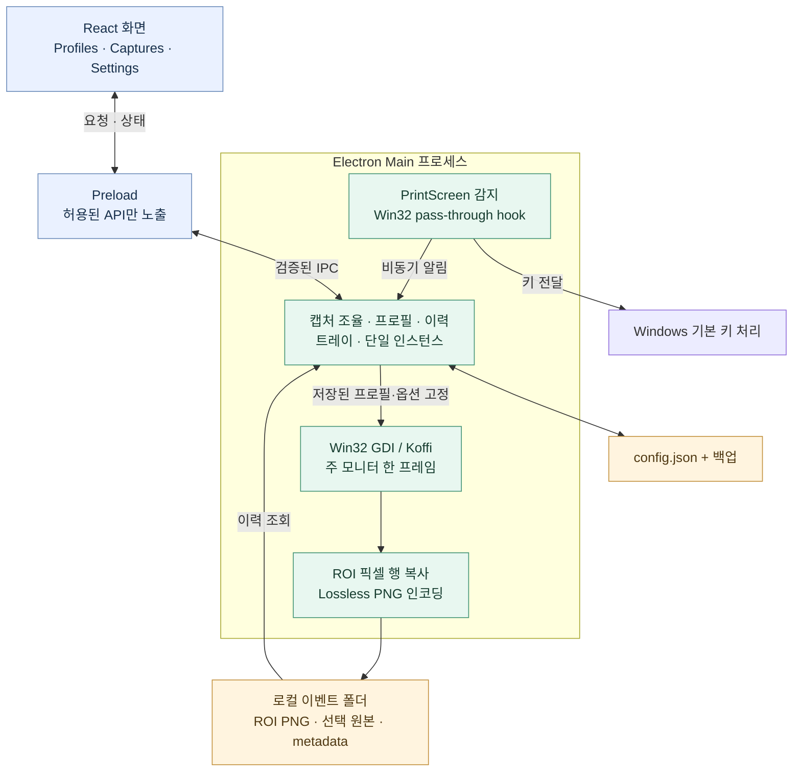

<p align="center">
  
</p>

# DFragonCropper

**PrintScreen 한 번으로, 필요한 화면 영역을 각각 PNG로.**

DFragonCropper는 Windows 화면에서 반복해서 저장할 영역을 미리 지정해 두는 캡처 앱입니다. 영역들을 프로필로 묶고 PrintScreen을 누르면, 주 모니터의 **동일한 한 프레임**에서 각 영역을 잘라 원래 픽셀 그대로 저장합니다.

**Windows 10 x64 · Portable · 로컬 저장 · 0.3.1 미리보기**

[Windows 다운로드](https://github.com/blahaj94/dfragon-cropper/releases) · [빠른 시작](#빠른-시작) · [아키텍처](#아키텍처) · [사용 가이드](docs/user-guide.md)



_제품 동작을 설명하는 개념도입니다. 실제 앱 스크린샷이 아닙니다._

## 이런 작업에 사용하세요

매번 같은 위치의 숫자, 표, 패널을 캡처한 뒤 다시 자르는 일을 줄여 줍니다. 전체 화면에서 필요한 영역만 지정해 놓으면, 다음 캡처부터 같은 좌표를 반복해서 사용할 수 있습니다.

| 기능                    | 동작                                                                                                     |
| ----------------------- | -------------------------------------------------------------------------------------------------------- |
| **화면에서 영역 지정**  | 정지 미리보기에서 드래그하거나 `X / Y / Width / Height`를 직접 입력합니다.                               |
| **프로필별 영역 저장**  | 작업별로 여러 ROI를 묶고, 캡처에 쓸 활성 프로필을 선택합니다.                                            |
| **한 프레임, 여러 PNG** | 한 번 얻은 원본에서 모든 ROI를 만듭니다. 확대·축소, 필터, JPEG 변환을 하지 않습니다.                     |
| **백그라운드 캡처**     | 앱을 트레이에 둔 채 PrintScreen으로 캡처합니다. Windows의 기본 키 처리를 가로채지 않습니다.              |
| **캡처 이력 확인**      | 최근 100개 이벤트의 원본·ROI 이미지를 열고 저장 폴더로 이동합니다. 오래된 파일은 자동 삭제하지 않습니다. |
| **내 PC에 보관**        | PNG와 설정을 로컬에 저장합니다. 원본 전체 화면의 저장 여부도 선택할 수 있습니다.                         |

## 빠른 시작

[릴리스 페이지](https://github.com/blahaj94/dfragon-cropper/releases)에서 `DFragonCropper-0.3.1-x64-portable.exe`를 받아 쓰기 가능한 폴더에 두고 실행하세요. 설치 과정 없이 사용할 수 있는 코드서명되지 않은 미리보기 빌드입니다. 다운로드 확인과 업데이트 방법은 [배포 안내](docs/distribution.md)를 참고하세요.

1. **영역 지정** — `Profiles` → `Refresh screen preview`로 화면을 가져옵니다. 미리보기에서 드래그한 뒤 `Add drawn ROI`로 저장합니다. 숫자 좌표로도 추가·수정할 수 있습니다.
2. **프로필 선택** — 사용할 프로필에서 `Use for captures`를 누릅니다. 편집 중인 입력은 명시적으로 저장해야 캡처에 반영됩니다.
3. **캡처** — 원하는 화면을 띄우고 **PrintScreen**을 누릅니다. `Capture Now` 버튼으로도 캡처할 수 있습니다.
4. **결과 확인** — `Captures`에서 `Refresh history`를 누르거나 `Open output folder`로 PNG 파일을 확인합니다.

처음 실행하면 예시 ROI 두 개가 있는 `Default` 프로필로 시작합니다. 원하는 영역으로 바꾸어 사용하세요. ROI는 주 모니터 왼쪽 위를 기준으로 한 **물리 픽셀 좌표**이며, 화면 해상도가 달라지면 미리보기를 새로 가져와 확인해야 합니다.

> [!TIP]
> 기본 설정에서는 창을 닫아도 트레이에서 캡처를 계속 기다립니다. 완전히 종료하려면 **Quit**를 누르세요. 전체 화면 원본이 필요 없다면 `Settings`에서 **Save original PNG**를 끄고 저장하세요.

영역 편집, 저장 전 변경사항, 트레이 동작은 [사용 가이드](docs/user-guide.md)에 자세히 정리했습니다.

## 저장되는 결과

한 번의 캡처는 실행 파일 옆 `captures/` 아래에 하나의 이벤트 폴더로 저장됩니다.

```text
captures/
└── <capture-event>/
    ├── original.png     # 원본 저장 옵션이 켜져 있을 때
    ├── 001.png          # ROI ID 1의 저장 영역
    ├── 002.png          # ROI ID 2의 저장 영역
    └── metadata.json    # 프로필, 좌표, 캡처 정보
```

프로필과 설정은 실행 파일 옆 `config.json`에 보관됩니다. 저장 위치, 백업과 복구 방법은 [설정·데이터 안내](docs/configuration.md)를 참고하세요.

## 아키텍처

화면은 React로 구성하고, Windows 키 감지·화면 캡처·파일 저장은 Electron의 Main 프로세스에서 처리합니다. Renderer는 제한된 Preload API를 통해서만 요청하며 Main이 요청과 데이터를 검증합니다.



캡처가 시작되면 저장된 활성 프로필과 옵션을 고정합니다. 원본 저장을 꺼도 메모리에서 얻는 프레임은 하나이며, 같은 이벤트의 모든 ROI는 그 프레임에서 생성됩니다. 구현 구조와 검증 절차는 [개발 가이드](docs/development.md)에서 확인할 수 있습니다.

## 지원 범위

- **현재 지원:** Windows 10 x64, 주 모니터, 창 모드·테두리 없는 전체 화면, 로컬 PNG 저장.
- **검증:** Windows 10 build 19045의 100%·150% 배율에서 물리 픽셀 좌표와 ROI 결과를 확인했습니다. 자세한 증거와 한계는 [0.3.0 검증 기록](docs/local-mvp-verification.md)에 있습니다.
- **현재 미지원:** 보조 모니터 선택, 서버 업로드, OCR, 자동 시작·자동 업데이트. HDR·보호된 영상·독점 전체 화면의 픽셀 충실도는 보장하지 않습니다.

저장 중 추가 캡처 입력은 대기열에 쌓이지 않고 건너뛴 횟수로 표시됩니다. OS 커서는 합성하지 않지만, 게임 등이 화면 픽셀에 직접 그린 커서는 포함될 수 있습니다.

## 더 알아보기

| 문서                                      | 내용                                          |
| ----------------------------------------- | --------------------------------------------- |
| [사용 가이드](docs/user-guide.md)         | 프로필, ROI 편집, 캡처 이력과 트레이 사용     |
| [설정·데이터 안내](docs/configuration.md) | 저장 위치, 설정 이관, 백업과 복구             |
| [다운로드·업데이트](docs/distribution.md) | 실행 파일, 체크섬과 새 버전으로 교체하는 방법 |
| [개발 가이드](docs/development.md)        | 개발 환경, 빌드, 코드 구조와 검증             |
| [문서 목록](docs/README.md)               | 현재 가이드와 단계별 검증 기록                |
