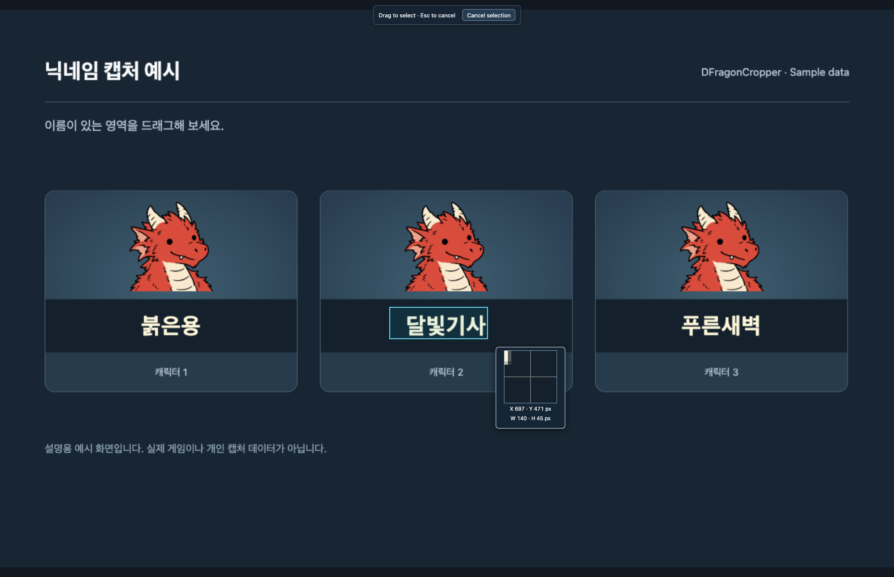
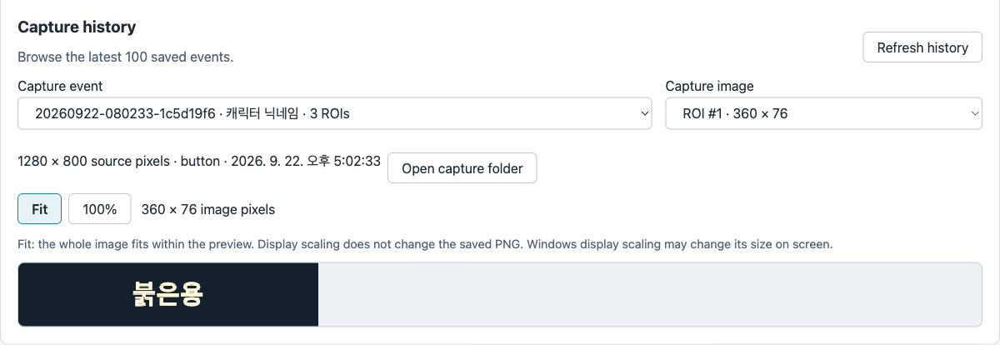
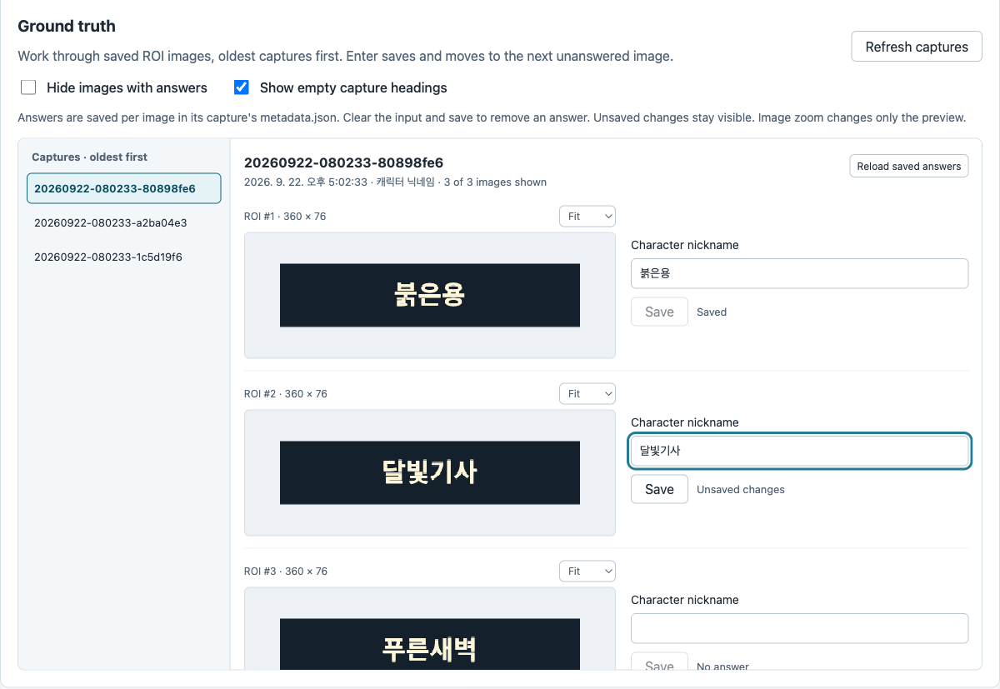

  

# DFragonCropper

**화면에서 필요한 영역만 모으고, 이미지 옆에 캐릭터 닉네임을 적으세요.**

Windows 10 x64 · 설치 없이 실행 · 0.5.0 미리보기

[**Windows 다운로드**](https://github.com/blahaj94/dfragon-cropper/releases/download/v0.5.0/DFragonCropper-0.5.0-x64-portable.exe) · [릴리스 노트](https://github.com/blahaj94/dfragon-cropper/releases/tag/v0.5.0)

받은 EXE를 쓰기 가능한 폴더에 두고 실행하세요.

실제 앱 화면입니다. 예시 이미지를 사용해 macOS 개발 환경에서 촬영했습니다.

## 1. 캡처할 영역 정하기

`Profiles`에서 **F12**를 누르고 원하는 영역을 드래그하세요. 커서 옆 확대경으로 작은 글자도 맞출 수 있습니다.
돌아온 창에서 `Add drawn ROI`로 저장하고, 사용할 프로필의 `Use for captures`를 누르세요.

## 2. PrintScreen으로 모으기

원하는 화면에서 **PrintScreen**을 누르면 저장한 영역마다 PNG가 생깁니다.
`Captures` → `Refresh history`에서 결과를 확인하세요. 파일은 EXE 옆 `captures/`에 쌓입니다.

## 3. 이미지 옆에 닉네임 적기

`Ground Truth`에서 오래된 캡처부터 내려가며 닉네임을 입력하세요.
**Save**는 한 장씩 저장하고, **Enter**는 저장 후 다음 미작성 이미지로 이동합니다.
정답이 있는 이미지는 숨길 수 있고, 왼쪽 목차로 원하는 캡처에 바로 갈 수 있습니다. 입력한 정답은 각 캡처의 `metadata.json`에 저장됩니다.

기본 설정에서는 창을 닫아도 트레이에서 계속 실행됩니다. 완전히 종료하려면 **Quit**를 누르세요.

[사용 가이드](docs/user-guide.md) · [정답 작성](docs/ground-truth.md) · [설정·복구](docs/configuration.md) · [개발 문서](docs/development.md)
